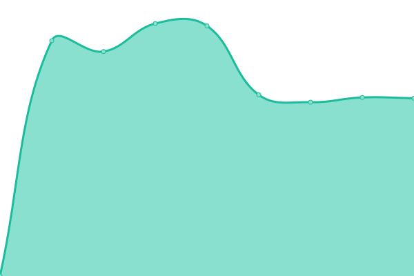
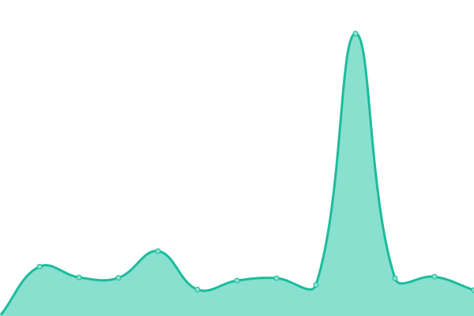
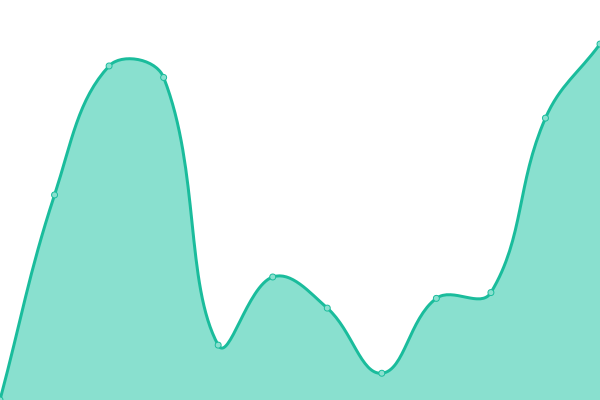

# [📈 Live Status](https://sena-design-studio.github.io/uptime): <!--live status--> **🟧 Partial outage**

This repository contains the open-source uptime monitor and status page for [sena-design-studio](https://sena-design-studio.github.io/uptime), powered by [Upptime](https://github.com/upptime/upptime).

With [Upptime](https://upptime.js.org), you can get your own unlimited and free uptime monitor and status page, powered entirely by a GitHub repository. We use [Issues](https://github.com/sena-design-studio/uptime/issues) as incident reports, [Actions](https://github.com/sena-design-studio/uptime/actions) as uptime monitors, and [Pages](https://sena-design-studio.github.io/uptime) for the status page.

<!--start: status pages-->
<!-- This summary is generated by Upptime (https://github.com/upptime/upptime) -->
<!-- Do not edit this manually, your changes will be overwritten -->
<!-- prettier-ignore -->
| URL | Status | History | Response Time | Uptime |
| --- | ------ | ------- | ------------- | ------ |
|  [Scopphu](https://www.scopphu.com) | 🟩 Up | [scopphu.yml](https://github.com/sena-design-studio/uptime/commits/HEAD/history/scopphu.yml) | 

 2239ms
     
 | 

<a href="https://sena-design-studio.github.io/uptime/history/scopphu">100.00%</a>
    

|  [Costa Verde](https://www.costa-verde.com) | 🟥 Down | [costa-verde.yml](https://github.com/sena-design-studio/uptime/commits/HEAD/history/costa-verde.yml) | 

 5710ms
     
 | 

<a href="https://sena-design-studio.github.io/uptime/history/costa-verde">98.29%</a>
    

|  [Lockedin](https://www.lockedin.pt) | 🟥 Down | [lockedin.yml](https://github.com/sena-design-studio/uptime/commits/HEAD/history/lockedin.yml) | 

 3285ms
     
 | 

<a href="https://sena-design-studio.github.io/uptime/history/lockedin">98.48%</a>
    

|  [Otica Martinho](https://www.oticamartinho.pt) | 🟥 Down | [otica-martinho.yml](https://github.com/sena-design-studio/uptime/commits/HEAD/history/otica-martinho.yml) | 

 5077ms
     
 | 

<a href="https://sena-design-studio.github.io/uptime/history/otica-martinho">98.09%</a>
    

<!--end: status pages-->

[**Visit our status website →**](https://sena-design-studio.github.io/uptime)

## 📄 License

- Powered by: [Upptime](https://github.com/upptime/upptime)
- Code: [MIT](./LICENSE) © [sena-design-studio](https://sena-design-studio.github.io/uptime)
- Data in the `./history` directory: [Open Database License](https://opendatacommons.org/licenses/odbl/1-0/)
